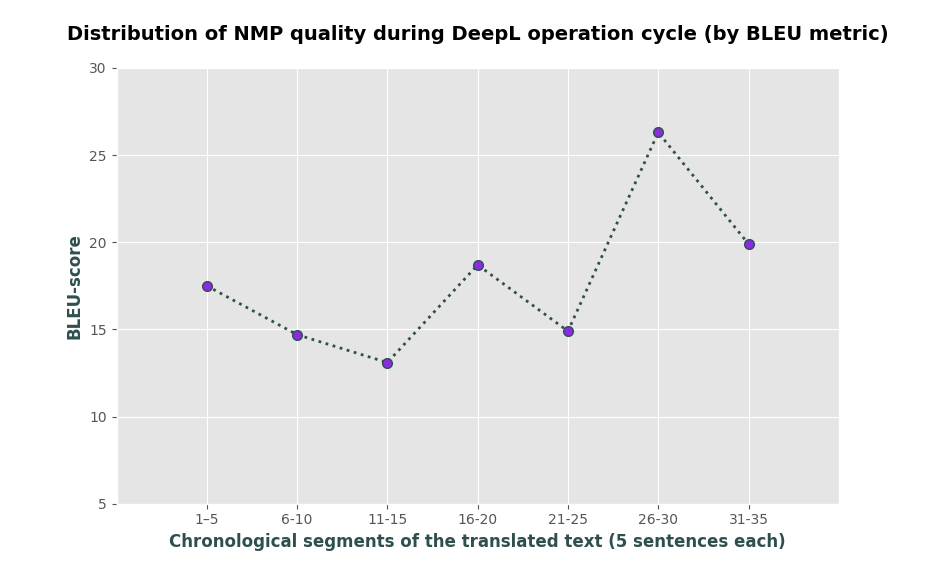
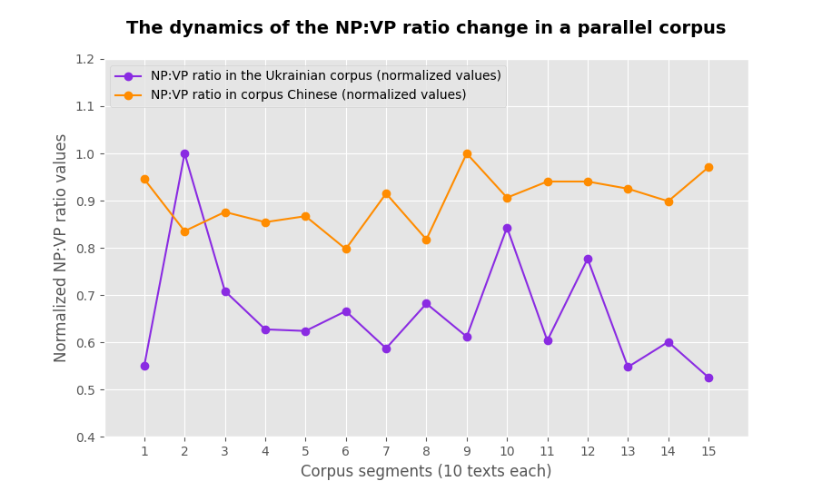

<!-- 

  
  

 -->

<!-- HEADER START -->

<picture>
  <source media="(prefers-color-scheme: dark)" srcset="renknu_logo.png">
  <source media="(prefers-color-scheme: light)" srcset="renknu_logo.png">
  
</picture>

# Syntax Corpus Analysis for Chinese-Ukrainian Machine Translation 

This project is the research work for Thesis work in Bachelor's Degree at Taras Shevchenko  National University of Kyiv.

<!--  -->

<!-- HEADER END -->

<!-- BODY START -->

###  Key features of the project:

- 📖 **NLP** with **Python** in terms of **Neural Machine Translation**;
- 📊 [Corpus analysis](https://github.com/SweetLink/syntax-corpus-analysis-uk-zh/tree/main/analysis-functions) of the syntax features of **🇨🇳Chinese** and **🇺🇦Ukrainian** languages;
- 🤔 [BLEU-score](https://github.com/SweetLink/syntax-corpus-analysis-uk-zh/tree/main/bleu_test) evaluation;
- 🎉 New Chinese-Ukrainian translation approaches;
- 🛠️ **NMP system** improvement strategies.
- ⚡ Check out the **full PDFs** for the Thesis work in [Ukrainian]() and [English]().

<!--  -->

 

<!-- CONTRIBUTORS START -->

##  Contributors

<table border="0" width="100%">
 <tr>
    <td  align='center'><b style="font-size:20px">
    

Anastasiia Burda <a href="https://orcid.org/0009-0005-8269-3553">
    
    <!-- <picture>
    <source media="(prefers-color-scheme: dark)" srcset="https://static-00.iconduck.com/assets.00/orcid-icon-2048x2048-q87cnnge.png">
    <source media="(prefers-color-scheme: light)" srcset="https://cdn.icon-icons.com/icons2/2389/PNG/512/orcid_logo_icon_145004.png">
    </picture> -->
</a> 

    </b></td>
    <td  align='center'><b style="font-size:20px">

Oleksandr Kozoriz <a href="https://orcid.org/0000-0002-4502-583X">
    
<!-- </a>  -->

</b></td>
 </tr>

 <tr>
    <td>
    

    - ✍️ The author of the study, a student;  
    - 🎓 Taras Shevchenko  National University of Kyiv; 
    - 📍 Kyiv, Ukraine.
    
 </td>
    <td> 
    - 📋 Ph. D. in Philology, Teaching assistant of Department of Languages and Literatures of the Far East and Southeast Asia
    Taras Shevchenko National University of Kyiv; 
    – 🎓 Taras Shevchenko  National University of Kyiv; 
    - 📍 Kyiv, Ukraine.
    </td>
 </tr>
</table>

 

<!-- CONTRIBUTORS END -->

<!-- DESCRIPTION START -->

##  Description

  

  
  👩🏼‍💻 Repository contains the implementation of the practical research for Bachelor's Thesis work on the topic **"Corpus-based research on syntactic transformations in Chinese-Ukrainian translation of publicity texts"**.

🧱 The whole work consists of few **blocks of data**:

- [Various functions for syntax analysis]();
- [BLEU-score evaluation functions]();
- [The parallel Chinese-Ukrainian corpus of publicity texts]().

📈 For more vivid representation of the results and particular tendencies discovered in the structure of Chinese and Ukrainian languages, some **graphs** were generated:

  
  

 

<!-- DESCRIPTION END -->

<!-- RESEARCH BACKGROUND START-->

##  Research background and inspiration

 

    “💡 The technical problem: How accurately can the symbols of communication be transmitted
    💡 The semantic problem: How precisely do the transmitted symbols convey the desired meaning?
    💡 The effectiveness problem: How effectively does the received meaning affect conduct in the desired way?”

     - Warren Weaver, The Mathematical Theory of Communication

 

💡 The idea of the way Machine Translation should process the Natural Languages not only making the statement clear, but also making the right impact on the receiver, date back to the arise of MT itself.

🏔️ The relevance of the study is due to **the growing demand for the involvement of MP systems**, currently, in particular, **neural machine translation (NMT)**, in various areas of human activity and the need to improve the efficiency of their work through the study of the linguistic aspect of translation. We consider **the syntactic structure of languages ​​as one of the levels that has a significant** impact on message formation. In the ordinary life of a person, the selection of an adequate sentence structure, the involvement of constructions in the flow of speech are based on aspects of a specific situation.

🇨🇳🇺🇦 In the **Chinese-Ukrainian language pair**, as structurally significantly different languages, many questions arise during translation regarding appropriate syntactic transformations. That is, the principle of message formation by the medium is multifaceted, which necessitates the study of syntax in the context of translation, in particular, in terms of methods of improving NMP systems.

🧪 **Background research work:**

- [Future Perspectives Of Machine Translation: Efficiency Of The Modern Software And AI Tools]();
- [The Role of Humans in the Process of Machine Translation of Chinese-Ukrainian Texts: Post-Processing from the Aspect of Syntax]();
- [Methods Of Improving Machine Translation Systems In The Context Of Corpus Linguistics]().

 

<!-- RESEARCH BACKGROUND END-->

<!-- SKILLS START -->

## Skills & Qualifications

- 📚 Gathering and cleaning **large amounts of text data**;
- 👩🏼‍💻 Ensuring it's suitable for training **NMT systems**;
- 🔖 Choosing appropriate **Python** tools for **corpus processing** and **syntax analysis**;
- 🔍 Deep analysis of **natural languages structure**;
- 🧮 Predicting the impact of certain features on NMT;
- 🔬 In-hand experience of NMT system working flow and the **evaluation** of its product;
- 🛠️ Integration of theoretical linguistics knowledge into the **back-end algorithms of NMT systems** through Python programs;
- ⚡ Monitoring and improving NLP models and NMT systems;
- 🖋️ Adapting the algorithms to evolving language patterns and user needs;
- 🐉 Bringing the **cultural aspect** of the process of speech delivery and acceptance as the key driver for the improvement of current NMT systems.

 

<!-- SKILLS END -->

<!-- BODY END -->

<!-- Gifs -->
<!--  -->

<!--  -->

<!--  -->

<!--  -->

<!--  -->
