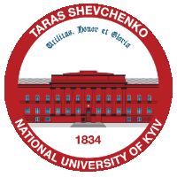

<!-- 

  
  

 -->

<picture>
  <source media="(prefers-color-scheme: dark)" srcset="renknu_logo.png">
  <source media="(prefers-color-scheme: light)" srcset="renknu_logo.png">
  
</picture>

# Syntax Corpus Analysis for Chinese-Ukrainian Machine Translation 

#### This project is the research work for Thesis work in Bachelor's Degree at Kyiv National University.

<!--  -->

###  Key features of the project:

- 📖 **NLP** with **Python** in terms of **Neural Machine Translation**;
- 📊 [Corpus analysis](https://github.com/SweetLink/syntax-corpus-analysis-uk-zh/tree/main/analysis-functions) of the syntax features of **🇨🇳Chinese** and **🇺🇦Ukrainian** languages;
- 🤔 [BLEU-score](https://github.com/SweetLink/syntax-corpus-analysis-uk-zh/tree/main/bleu_test) evaluation;
- 🎉 New Chinese-Ukrainian translation approaches;
- 🛠️ **NMP system** improvement strategies.
- ⚡ Check out the **full PDFs** for the Thesis work in [Ukrainian]() and [English]().

<!--  -->

 

##  Contributors

 

##  Description

##  Research background and inspiration

> “**The technical problem**: How accurately can the symbols of communication be transmitted?  **The semantic problem**: How precisely do the transmitted symbols convey the desired meaning?  **The effectiveness problem**: How effectively does the received meaning affect conduct in the desired way?”   _— **Warren Weaver**, The Mathematical Theory of Communication_

The idea of the way Machine Translation should process the Natural Languages not only making the statement clear, but also making the right impact on the receiver, date back to the arise of MT itself:

 

<!-- ## Skills & Qualifications -->

<!-- Gifs -->
<!--  -->

<!--  -->

<!--  -->

<!--  -->

<!--  -->

<!--  -->
